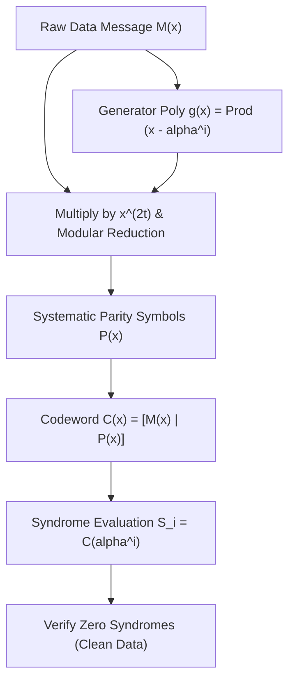

# genpark-reed-solomon-error-correcting-code-skill

Agent Skill implementing **Systematic Reed-Solomon Error-Correcting Code** over Galois Field $GF(2^8)$ with generator polynomial synthesis and syndrome checking.

## Architectural Overview

